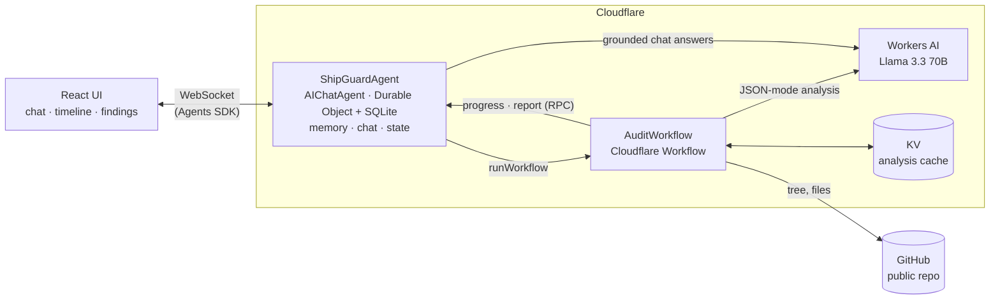

# ShipGuard

**An AI deployment preflight and debugging agent for Cloudflare Workers.** Give it a public GitHub repository; it runs a durable, staged audit, backs every finding with evidence from the actual files, remembers what it found, and answers follow-up questions from what it stored.

**Live demo:** LIVE_URL_PLACEHOLDER

Built for Cloudflare's AI application assignment. The repository name follows the required `cf_ai_` prefix, [PROMPTS.md](./PROMPTS.md) holds the AI prompts used, and everything here was written for this submission.

## What it does

Paste `https://github.com/owner/repo` (or a `/tree/branch/folder` URL for one folder of a monorepo). ShipGuard then:

1. resolves the exact commit, lists the files, and selects the ones that matter for a Cloudflare deploy under a strict fetch and token budget;
2. runs **19 deterministic rules** over `wrangler.jsonc/json/toml`, `package.json`, `tsconfig.json` and the source: Durable Object bindings versus `exports`/`migrations`, missing Workers AI bindings, classes that are configured but not exported, secrets committed in `vars`, environments that do not redefine bindings, and more, each with a documentation link and a stated confidence;
3. asks **Llama 3.3 on Workers AI** to reason across the findings, prioritise them and propose extra issues, then **verifies every claim** against the files the model was actually shown (fabricated paths and lines are dropped);
4. stores the report and answers questions such as *"What migration issue did you find earlier?"* or *"Did we fix F-001?"* from that stored history.

A finding looks like this:

> **F-001 · High · CF_DO_NOT_DECLARED** — Durable Object class `DeploymentAgent` is bound but never declared
> Evidence: `wrangler.jsonc:6` `"class_name": "DeploymentAgent"` · Fix: declare it under `exports` · Docs: linked

## Why this is an agent, not a wrapper

| Property | How |
|---|---|
| **Identity** | One `ShipGuardAgent` Durable Object per workspace (`AIChatAgent`), addressed by a private UUID |
| **Durable execution** | The audit is a Cloudflare **Workflow**; reload, close the tab or lose the connection and it carries on |
| **Real tools** | GitHub reads, a config parser, a rule engine, a secret scanner, an evidence verifier: all code, none of it asked of the model |
| **Memory** | Audits, findings, stable finding ids (`F-001`…), decisions and diffs in the agent's SQLite; chat answers are built from it |
| **Honest progress** | The timeline shows stages finishing as they really do, with measured times; nothing is timer-driven |
| **Failure handling** | Bad input, missing repos, rate limits, model failures and lost workflows each produce a visible, specific outcome |

Deterministic code does everything code can do reliably (parsing, matching, scanning, verifying, diffing). The model is used for reasoning across findings, prioritisation, explanation and follow-up answers.

## Architecture



Workflow steps: `resolve-repository` → `list-files` → `classify-files` → `fetch-config-files` → `fetch-source-files` → `scan-files-N` → `run-rules` → `ai-analysis` → `verify-findings` → `persist-report`. The full rationale, including what the model decides versus what stays deterministic, is in [docs/ARCHITECTURE.md](./docs/ARCHITECTURE.md).

## Cloudflare technologies

| Product | Used for |
|---|---|
| **Workers AI** | `@cf/meta/llama-3.3-70b-instruct-fp8-fast`: JSON-mode analysis (not streamed) and streaming chat |
| **Agents SDK** (`agents`, `@cloudflare/ai-chat`) | The agent, persisted chat, resumable streams, WebSocket state sync, callable methods, scheduling |
| **Durable Objects (SQLite)** | Agent identity, chat history, all project memory. Declared with the current `exports` field |
| **Workflows** | The durable, checkpointed audit (`AgentWorkflow` for typed callbacks to the agent) |
| **Workers KV** | Content-addressed cache of AI analyses (protects the free neuron allowance) |
| **Workers Static Assets** | The React app, with a CSP from `_headers` |
| **Observability** | Workers Logs (structured JSON) and Agents tracing (`observability.traces`) |
| Optional: **AI Gateway** | Set `AI_GATEWAY_ID` to route model calls through a gateway for logs, caching and cost metrics |

Deliberately **not** used: Project Think/ThinkWorkflow (the docs report that this model ignores forced tool choice while streaming), Sandbox (paid plan), Browser tools (experimental), MCP, Code Mode. See [docs/RESEARCH.md](./docs/RESEARCH.md) for the dated research and the reasoning.

## Try it in two minutes

1. Open the live demo (or run it locally, below).
2. Click **Try the demo**. It audits `examples/demo-worker` at the `demo-broken` tag, which has four seeded mistakes. Watch the timeline fill in stage by stage.
3. Open **Findings**. Expand `F-001`: file, line, excerpt, why it matters, fix.
4. Ask **"What should I fix first?"**
5. **Reload the page.** The audit, findings, history and conversation are all still there.
6. Audit the fixed commit: paste `https://github.com/LuciferK47/cf_ai_shipguard/tree/main/examples/demo-worker`. ShipGuard reports what was **resolved**, what is **still present**, and keeps the same finding ids.
7. Ask **"What migration issue did you find earlier?"** and **"Did we fix F-001?"**: the answers come from the stored audits.
8. Optionally tick **Watch for new commits**.

## Run it locally

Requires Node 22+ and npm.

```bash
git clone https://github.com/LuciferK47/cf_ai_shipguard.git
cd cf_ai_shipguard
npm ci
```

**Without a Cloudflare account (offline mode).** GitHub access and every rule are real; only the language model is replaced by a clearly labelled local stand-in that answers from the audit data:

```bash
npm run dev:offline        # http://localhost:5173
```

**With real Workers AI.** Workers AI has no local simulator, so `dev` proxies the binding to Cloudflare:

```bash
npx wrangler login
npm run dev
```

## Deploy

```bash
npx wrangler login
npm run deploy               # builds, provisions the KV namespace, deploys
npx wrangler secret put GITHUB_TOKEN   # optional but recommended (see below)
```

`wrangler deploy` creates the KV namespace automatically (the binding has no id). The Durable Object and Workflow are declared in `wrangler.jsonc`. It runs on the **Workers Free plan**.

### Configuration

| Name | Kind | Required | Purpose |
|---|---|---|---|
| `AI` | binding | yes | Workers AI |
| `ShipGuardAgent` | Durable Object | yes | The agent (`exports`, SQLite) |
| `AUDIT_WORKFLOW` | Workflow | yes | The audit |
| `ANALYSIS_CACHE` | KV | yes (auto-provisioned) | Analysis cache |
| `GITHUB_TOKEN` | secret | no | A **fine-grained token with no permissions** (public read-only) raises GitHub's limit from 60 to 5,000 requests per hour. Without it a busy demo can hit GitHub's per-IP limit; the app then says so. |
| `AI_GATEWAY_ID` | secret or var | no | Route model calls through AI Gateway |

`GET /api/health` reports which optional features are configured, never their values.

### Free plan notes

The Free plan allows 10,000 Workers AI neurons per day (about 14 large audits) and 50 subrequests and 10 ms of CPU per Workflow step. The design respects both: bounded fetches, batched CPU work, and a cache so re-auditing the same commit costs no neurons. If the allocation runs out the audit still completes with deterministic findings and says the AI step was unavailable.

## Testing

```bash
npm run check      # format check, lint, typecheck
npm test           # 610 tests across three projects
npm run eval       # deterministic scorecard  → evals/results/
npm run build
```

`npm test` runs three Vitest projects: **unit** (pure logic, real SQLite), **client** (React components, jsdom) and **workers**, which runs the real agent and Workflow inside workerd against a fixture-backed fake GitHub and a mock Workers AI. That last project found bugs the Node tests could not (a `fetch` option the Workers runtime rejects). `npm run eval:llm` runs the real model when credentials are provided.

## Security model

Repository text and model output are treated as untrusted data; the model has no tools; URLs are strictly validated and rebuilt; `.env` files are never fetched; secrets are redacted before storage, display, logs and prompts; model claims are verified against what it was shown; and rendered chat text cannot contain images, links or HTML. Details, limits and residual risks: [docs/SECURITY.md](./docs/SECURITY.md).

## Evaluation

A small, honest evaluation: a deterministic scorecard over 21 fixtures (all seeded issues found, no findings on clean fixtures) and an opt-in LLM eval. The fixtures were written with the rules, so this is regression protection, not proof of accuracy on unseen repositories. See [docs/EVALUATION.md](./docs/EVALUATION.md).

## Design trade-offs

- **`AIChatAgent` + `AgentWorkflow`, not Think.** Think's workflow helper needs forced tool calls, which this model does not honour while streaming.
- **No model-driven tools in chat.** Retrieval and commands are deterministic; the model only writes the answer. Streaming tool calls on Llama 3.3 are unreliable.
- **`exports`, not `migrations`.** Cloudflare now recommends the declarative `exports` field for new Durable Objects. The rules understand both, because most existing repositories use `migrations`.
- **Read-only.** No pull requests, no issue creation, no repository code execution. A trustworthy diagnosis is more useful than a half-working autonomous bot.
- **Free-plan-first limits.** Smaller per-audit budgets than a paid plan would allow, so a reviewer needs nothing beyond a free account.

## Limitations

- **Coverage is partial by design.** Up to 16 files (about 200 KB) are read per audit. "No findings" means none in the files that were read; the UI says which files those were.
- **Large repositories** (over about 4,000 files) must be audited by sub-directory. The error says how.
- **Public repositories only.** Without `GITHUB_TOKEN`, GitHub's per-IP limit can throttle a busy deployment.
- **No accounts.** The workspace URL is a private bearer link; anyone with it can read that workspace.
- **Rules are a starting set.** Nineteen rules cover common Cloudflare configuration mistakes. Some (such as "class not exported") are heuristic and state their confidence.
- **The model is small and imperfect.** Its output is verified, capped at high severity, and labelled, but it can still write unhelpful prose. Answers are grounded in stored data, not guaranteed correct.
- **A prototype.** It is not hardened for production use.

## AI-assisted development

This project was built with an AI coding agent (Claude Code). All prompts are recorded in [PROMPTS.md](./PROMPTS.md). Cloudflare's official agent skills and current documentation were consulted; the research is in [docs/RESEARCH.md](./docs/RESEARCH.md). A note on what the AI got wrong is in the git history: several bugs were found only by running the real runtime and the real UI, and each fix is a commit.

## Repository layout

```
src/server/   agent.ts · workflow.ts · github/ · ingest/ · config/ · checks/ (19 rules)
              ai/ (prompts, schemas, verify, LLM client) · chat/ · memory/ · audit/
src/client/   React UI (hooks, components, safe Markdown)
src/shared/   types shared by client and server
test/         unit/ · client/ · workers/ · fixtures/ (21 mini repositories)
evals/        deterministic + LLM evaluation
examples/     demo-worker (broken at tag demo-broken, fixed on main)
dev/offline/  local Workers AI stand-in for offline mode
docs/         ARCHITECTURE · RESEARCH · SECURITY · EVALUATION
```

MIT licensed.
